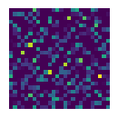
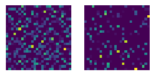
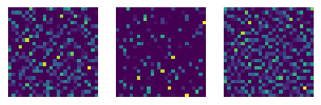
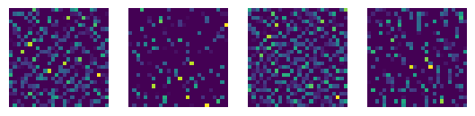
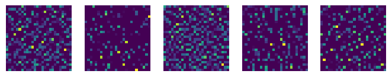
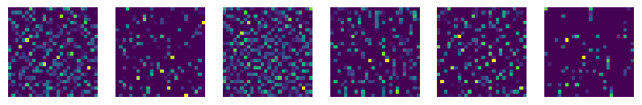

# Convolutional Neural Networks (CNNs)

## Description
Convolutional Neural Networks (CNNs) are a type of deep learning neural network that automatically extract hierarchical features from visual or structured data. CNNs are widely used in cybersecurity for phishing detection, malware recognition, and anomaly detection. This practical example demonstrates a CNN using a small synthetic dataset.

## Practical Example: Synthetic Phishing Image Classification

# Step 0: Import libraries
import numpy as np
import matplotlib.pyplot as plt
import os
from tensorflow.keras.models import Sequential, Model
from tensorflow.keras.layers import Input, Conv2D, MaxPooling2D, Flatten, Dense
from tensorflow.keras.utils import to_categorical

# Step 1: Generate synthetic data
num_samples = 100
img_size = 28
X = np.random.rand(num_samples, img_size, img_size, 1)
y = np.random.randint(0, 2, size=(num_samples,))
y_cat = to_categorical(y, 2)

# Step 2: Build CNN model
model = Sequential([
    Input(shape=(img_size,img_size,1)),
    Conv2D(16, (3,3), activation='relu'),
    MaxPooling2D((2,2)),
    Conv2D(32, (3,3), activation='relu'),
    MaxPooling2D((2,2)),
    Flatten(),
    Dense(64, activation='relu'),
    Dense(2, activation='softmax')
])

# Step 3: Compile and train
model.compile(optimizer='adam', loss='categorical_crossentropy', metrics=['accuracy'])
model.fit(X, y_cat, epochs=5, batch_size=10)

# Step 4: Feature map visualization
_ = model(X[:1])  # Initialize input

# Get outputs from first convolutional layer
layer_outputs = [layer.output for layer in model.layers if 'conv' in layer.name]
activation_model = Model(inputs=model.input, outputs=layer_outputs)
activations = activation_model.predict(X[:1])
first_layer_activation = activations[0]

# Step 5: Save feature maps to task_1/images/
os.makedirs('task_1/images', exist_ok=True)
for i in range(min(6, first_layer_activation.shape[-1])):
    plt.figure(figsize=(3,3))
    plt.imshow(first_layer_activation[0, :, :, i], cmap='viridis')
    plt.axis('off')
    plt.savefig(f'task_1/images/feature_map{i+1}.png', bbox_inches='tight')
    plt.close()

# Convolutional Neural Networks (CNNs)

## Description
Convolutional Neural Networks (CNNs) automatically extract hierarchical features from visual or structured data. They are widely used in cybersecurity for phishing detection, malware recognition, and anomaly detection.

## Practical Example: Synthetic Phishing Image Classification
*(Python code above generates and trains the CNN, and saves feature maps.)*

## Feature Maps from First Convolutional Layer

შუა ფენა (Conv2D) აღჭურვილია 16 ფილტრით, რომლებიც ავლენს სხვადასხვა ვიზუალური ელემენტს. ქვემოთ მოცემულია პირველი 6 feature map–ი:

### Feature Map 1

### Feature Map 2

### Feature Map 3

### Feature Map 4

### Feature Map 5

### Feature Map 6

