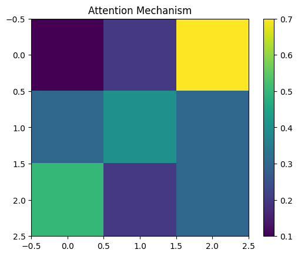

# Transformer Networks in Cybersecurity

## Description
Transformer networks are deep learning models designed for sequence modeling using **self-attention**. Unlike RNNs, transformers process sequences in parallel, which improves speed and performance.  
In cybersecurity, they are useful for analyzing logs, network traffic, or user behavior to detect anomalies, malware, or phishing attacks.  
Self-attention highlights important tokens or events in a sequence, making detection more interpretable.

## Attention Layer Mechanism

The attention layer calculates weights for each input token, emphasizing critical parts of the sequence and suppressing irrelevant ones.

## Positional Encoding

Since transformers do not process sequences sequentially, positional encoding adds information about the position of each token in the sequence.

## Practical Example
```python
from transformers import BertTokenizer, BertForSequenceClassification
import torch

# Load tokenizer and model
tokenizer = BertTokenizer.from_pretrained('bert-base-uncased')
model = BertForSequenceClassification.from_pretrained('bert-base-uncased', num_labels=2)

# Sample cybersecurity log
text = ["Suspicious login attempt detected from IP 192.168.1.1"]
inputs = tokenizer(text, return_tensors='pt', padding=True, truncation=True)
outputs = model(**inputs)
predictions = torch.argmax(outputs.logits, dim=1)

print(predictions)
