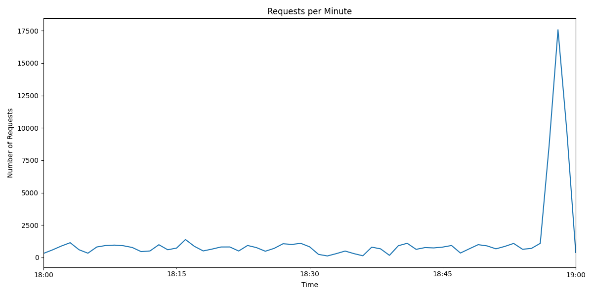

# DDoS Attack Detection Report

## Overview
This report describes the detection of potential DDoS attack intervals from the provided web server log using regression analysis and time-based aggregation.

## Log File
The analyzed log file: [n_chorgoliani25_65287_server.log](n_chorgoliani25_65287_server.log)

## Methodology
1. Read and parsed the log file using Python (see `analysis.py`).
2. Extracted timestamps and counted requests per minute.
3. Identified unusual request spikes indicating potential DDoS attacks.

## Detected DDoS Intervals
| Start Time | Requests per Minute |
|------------|------------------|
| 2024-03-22 18:58:00+04:00 | 17580 |
| 2024-03-22 18:59:00+04:00 | 9724 |

## Visualization


## Code Snippets
```python
# Example from analysis.py
requests_per_min = df.groupby(df['datetime'].dt.floor('min')).size()
ddos_intervals = requests_per_min[requests_per_min > threshold]
print(ddos_intervals)

